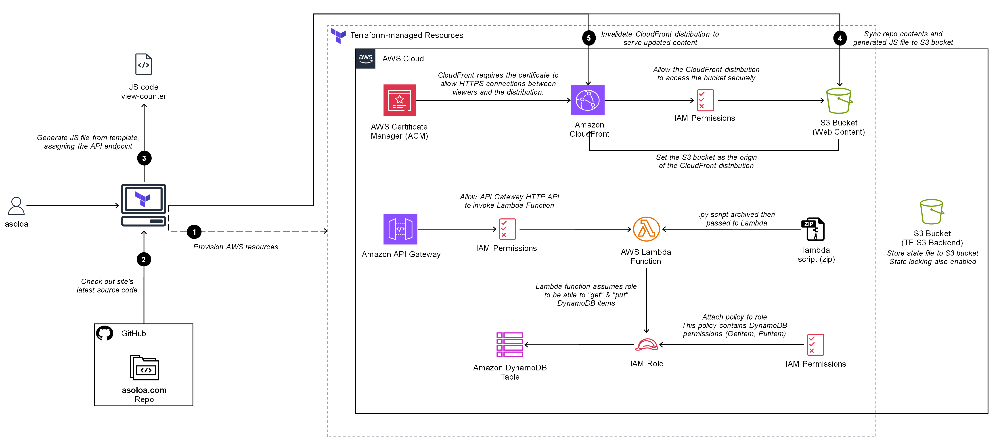

# asoloa.com.tf


**NOTE:** Not every resources and processes are shown in the diagram above.

For a broader view of the architecture, see [asoloa.com Architecture](assets/asoloa.com_Architecture.png).
\
For the full mapping of the resources, see [resource dependency graph](assets/graph.png).

---
## Modules

### acm module
&emsp;Provisions an ACM certificate for the domain, enabling HTTPS for CloudFront and API Gateway.

### api_gateway module
&emsp;Creates an API Gateway (HTTP API) for Lambda integrations, with CORS and route management.

### cloudfront module
&emsp;Configures a CloudFront distribution to serve static site assets securely and efficiently.

### dynamodb module
&emsp;Creates a DynamoDB table for storing view counts or other backend data.

### github module
&emsp;Manages GitHub Actions secrets/variables, storing outputs from other modules for CI/CD workflows.

### hostinger module
&emsp;Automates DNS record management (CAA, ALIAS, validation) via Hostinger for domain setup.

### lambda module
&emsp;Provisions a Lambda function for backend logic (e.g., view counter), with IAM and packaging.

### s3 module
&emsp;Creates an S3 bucket for static site hosting and as a CloudFront origin, with upload automation.

### chatbot module
&emsp;Provisions a serverless AI chatbot: Lambda proxy to OpenAI, API Gateway route, IAM, and S3 asset management.

---

## Workflows

### chatbot-to-s3.yaml
Automates deployment of chatbot frontend assets to S3 and updates index.html:

- Injects the API endpoint into chatbot.js
- Downloads and updates index.html to inject chatbot references and loader script
- Uploads chatbot HTML, JS, CSS to S3
- Uploads the updated index.html to S3
- Invalidates CloudFront cache for chatbot files and index.html

This workflow ensures the chatbot UI and backend are always in sync and available on the live site.

---

### terraform.tfvars
```hcl
hostinger_api_token = "HOSTINGER_API_TOKEN"
github_token        = "GITHUB_TOKEN"
github_repo         = "GITHUB_REPO"
github_repo_tf      = "GITHUB_TFREPO"

aws_region = "us-east-1"
access_key = "AWS_ACCESS_KEY"
secret_key = "AWS_SECRET_KEY"

domain_name         = "EXAMPLE.COM"
dynamodb_table      = "MY_TABLE"
site_files_path     = "../SITE_REPO"
site_files_git_repo = "https://github.com/USER/SITE_REPO.git"
view_count_html_id  = "HTML_ID_FOR_VIEW_COUNT"
```

### backend.tf & state.config
I am using S3 to store the state file and using [Partial configuration](https://developer.hashicorp.com/terraform/language/backend#partial-configuration).

Apply the necessary permissions on the backend bucket as shown [here](https://developer.hashicorp.com/terraform/language/backend/s3#permissions-required).
```hcl
### ./backend.tf 
terraform {
  backend "s3" {
    bucket       = ""
    key          = ""
    region       = ""
    use_lockfile = true
  }
}

### ./state.config
bucket       = "xxx-bucket"
key          = "terraform.tfstate"
region       = "us-east-1"
use_lockfile = true
```