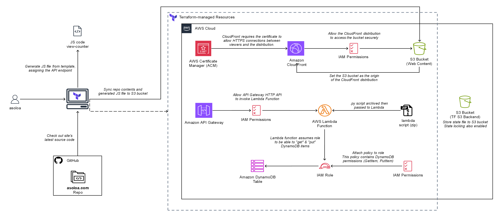

# asoloa.com.tf

**NOTE:** Not every resources and processes are shown in the diagram above.
For the full mapping of the resources, see the [resource dependency graph](assets/graph.png).

&nbsp;
List of Modules (creation and configuration):
- **acm** → handles the ACM certificate for our domain
- **api_gateway** → API endpoint that invokes our Lambda function
- **cloudfront** → distribution that serves our site assets securely
- **dynamodb** → database that stores our view count data
- **github** → uses outputs from other modules to store as secrets
- **hostinger** → adds the necessary DNS records (CAA, ALIAS, validation)
- **lambda** → function that processes the view count data
- **s3** → bucket that hosts our site assets